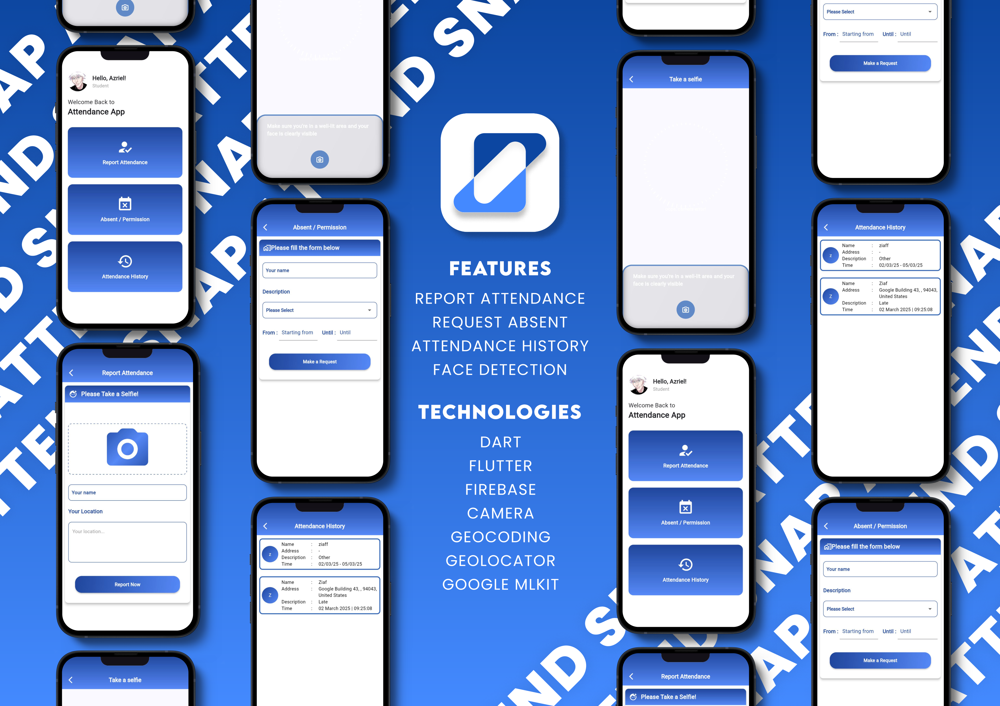

# 📸 Snap Attend - Smart Attendance System

Welcome to **Snap Attend**, the ultimate attendance tracking app powered by **Flutter** and **Firebase**! 🚀
Snap Attend makes attendance management seamless, secure, and efficient with advanced face recognition, geolocation tracking, and real-time reporting.

---

## 📋 Features

### ✅ **Smart Attendance Report**
- Upload attendance photos with **Google ML Kit Face Detection**.
- Ensures authenticity using real-time face recognition.

### 📍 **Geolocation-Based Attendance**
- Uses **Geocoding & Geolocator** for accurate location-based attendance.
- Prevents fake check-ins by verifying user location.

### 📌 **Request Absent / Permission**
- Submit absence requests directly from the app.
- Get approval from administrators with real-time notifications.

### 📜 **Attendance History**
- View detailed records of past attendance.
- Filter by date and status for easy tracking.

---

## 🚀 Technologies Used

Snap Attend is built using modern and efficient technologies:

- **Developed with:**
  - Dart & Flutter

- **Core Dependencies:**
  - [`firebase_core`](https://pub.dev/packages/firebase_core) - Firebase integration.
  - [`cloud_firestore`](https://pub.dev/packages/cloud_firestore) - Database for storing attendance records.
  - [`camera`](https://pub.dev/packages/camera) - Capturing attendance photos.
  - [`geocoding`](https://pub.dev/packages/geocoding) - Converting coordinates into readable addresses.
  - [`geolocator`](https://pub.dev/packages/geolocator) - Retrieving and verifying location data.
  - [`google_mlkit_face_detection`](https://pub.dev/packages/google_mlkit_face_detection) - Face recognition for authentication.

---

## 📸 Screenshots

Here’s a sneak peek at what you can expect:  

---

## 🎯 Why Choose Snap Attend?

With **Snap Attend**, managing attendance has never been easier. Say goodbye to manual registers and fake check-ins—embrace a smarter, more efficient system! 🔥

📌 **Secure** | 🎯 **Accurate** | 🌍 **Location-Based** | 📷 **Face-Verified**
